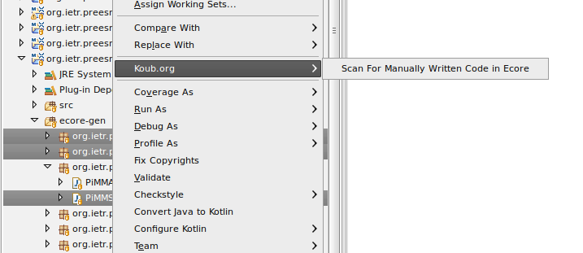

# JDT-Helpers
JDT Visitors to help analyse some specific characteristics

## Looking up for non generated methods

This feature add an entry in the context menu of the JDT package explorer:



The result of the analysis is shown in the console in textual format. It lists only Java classes found at the root of the compilation units that have at least one non generated method. Typical result is as follows:

```
Non generated methods found in given selected Java elements
  type >> Refinement.java :
    .getFilePath()
    .setFilePath()
  type >> PiGraph.java :
    .getVertexNamed()
    .getFifoIded()
    .getHierarchicalActorFromPath()
    .getParameterNamedWithParent()
    .getAllVertices()
  type >> AbstractActor.java :
    .getPath()
  type >> Actor.java :
    .isHierarchical()
    .getGraph()
  type >> AbstractVertex.java :
    .getPortNamed()
  type >> FunctionPrototype.java :
    .format()
```
